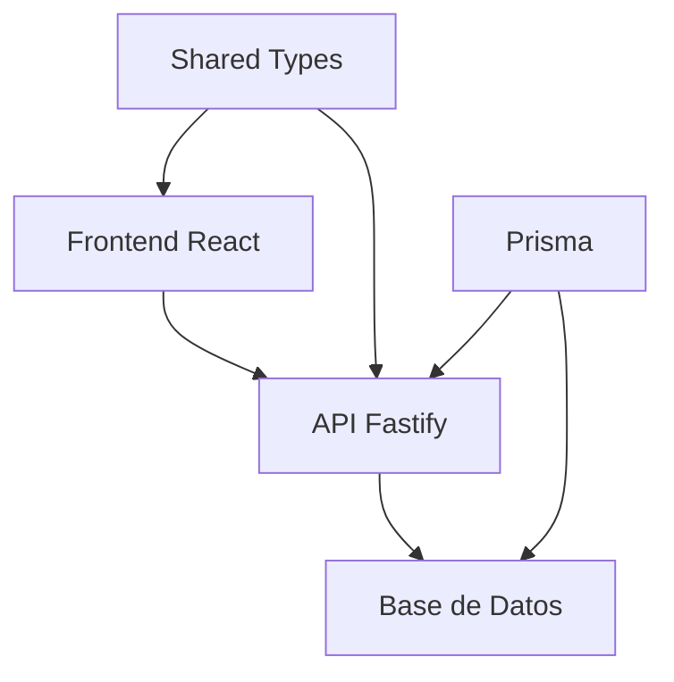

# 🏗️ Estructura del Proyecto

Este documento describe la organización de archivos y carpetas del proyecto **Social Network App**.

## 📁 Vista General

```
social-network-app/
├── 📁 backend/              # API con Fastify + TypeScript
├── 📁 frontend/             # Aplicación React + TypeScript
├── 📁 shared/               # Tipos y utilidades compartidas
├── 📁 docs/                 # Documentación del proyecto
├── 📁 .husky/               # Git hooks (Husky)
├── 📄 package.json          # Configuración del monorepo
└── 📄 README.md             # Documentación principal
```

## 🎯 Arquitectura de Monorepo

El proyecto utiliza **npm workspaces** para gestionar múltiples paquetes:

```json
{
  "workspaces": [
    "frontend",
    "backend", 
    "shared"
  ]
}
```

### Ventajas del Monorepo

- ✅ **Código compartido**: Tipos y utilidades centralizadas
- ✅ **Desarrollo sincronizado**: Cambios coordinados entre frontend/backend
- ✅ **Dependencias unificadas**: Gestión centralizada de paquetes
- ✅ **Scripts coordinados**: Comandos que afectan a todo el proyecto

## 🔙 Backend (`/backend/`)

```
backend/
├── 📁 src/
│   ├── 📁 config/           # Configuración (env, database, etc.)
│   ├── 📁 controllers/      # Controladores de rutas
│   ├── 📁 middleware/       # Middleware (auth, cors, etc.)
│   ├── 📁 models/           # Modelos de datos (actualmente vacío)
│   ├── 📁 routes/           # Definición de rutas
│   ├── 📁 services/         # Lógica de negocio (actualmente vacío)
│   ├── 📁 types/            # Tipos específicos del backend
│   ├── 📁 utils/            # Utilidades del backend
│   ├── 📁 generated/        # Código generado por Prisma
│   └── 📄 index.ts          # Punto de entrada de la aplicación
├── 📁 prisma/
│   ├── 📄 schema.prisma     # Esquema de base de datos
│   └── 📁 migrations/       # Migraciones de base de datos
├── 📄 package.json          # Dependencias del backend
├── 📄 tsconfig.json         # Configuración TypeScript
└── 📄 .env                  # Variables de entorno
```

### Tecnologías Backend

- **Fastify**: Framework web rápido y eficiente
- **Prisma**: ORM para gestión de base de datos
- **TypeScript**: Tipado estático
- **JWT**: Autenticación con tokens
- **bcryptjs**: Hashing de contraseñas

## 🎨 Frontend (`/frontend/`)

```
frontend/
├── 📁 src/
│   ├── 📁 components/       # Componentes React
│   │   ├── 📁 ui/           # Componentes UI reutilizables
│   │   └── 📁 social/       # Componentes específicos de red social
│   ├── 📁 hooks/            # Custom hooks de React
│   ├── 📁 pages/            # Componentes de página/vista
│   ├── 📁 services/         # Servicios API y comunicación
│   ├── 📁 styles/           # Estilos, temas y utilidades CSS
│   ├── 📁 theme/            # Sistema de temas (Material-UI)
│   ├── 📁 types/            # Tipos específicos del frontend
│   ├── 📁 utils/            # Utilidades del frontend
│   ├── 📄 App.tsx           # Componente principal de la app
│   └── 📄 main.tsx          # Punto de entrada de React
├── 📁 public/               # Archivos públicos estáticos
├── 📄 index.html            # Plantilla HTML principal
├── 📄 package.json          # Dependencias del frontend
├── 📄 tsconfig.json         # Configuración TypeScript
└── 📄 vite.config.ts        # Configuración de Vite
```

### Tecnologías Frontend

- **React 18**: Biblioteca de UI con hooks
- **TypeScript**: Tipado estático
- **Vite**: Build tool y dev server
- **Material-UI**: Componentes UI
- **React Router**: Navegación SPA
- **Axios**: Cliente HTTP

## 🔄 Shared (`/shared/`)

```
shared/
├── 📁 src/
│   ├── 📁 types/            # Tipos compartidos
│   │   ├── 📄 index.ts      # Tipos generales
│   │   └── 📄 social.ts     # Tipos específicos de red social
│   └── 📁 utils/            # Utilidades compartidas
├── 📄 package.json          # Configuración del paquete compartido
└── 📄 tsconfig.json         # Configuración TypeScript
```

### Propósito del Shared

- **Tipos compartidos**: Interfaces y tipos usados en frontend y backend
- **Validaciones**: Esquemas de validación compartidos
- **Constantes**: Valores constantes utilizados por ambos lados
- **Utilidades**: Funciones auxiliares reutilizables

## 📚 Docs (`/docs/`)

```
docs/
├── 📁 setup/               # Guías de instalación y configuración
├── 📁 architecture/        # Documentación de arquitectura
├── 📁 development/         # Guías de desarrollo
├── 📁 api/                 # Documentación de API
├── 📁 frontend/            # Documentación del frontend
├── 📁 deployment/          # Guías de despliegue
├── 📁 monitoring/          # Documentación de monitoreo
└── 📄 README.md            # Índice de documentación
```

## 🔧 Archivos de Configuración

### Raíz del Proyecto

- **`package.json`**: Configuración del monorepo y scripts
- **`.gitignore`**: Archivos ignorados por Git
- **`README.md`**: Documentación principal del proyecto

### Git Hooks (`.husky/`)

- **`pre-commit`**: Ejecuta lint-staged antes de commits
- **`pre-push`**: Ejecuta tests antes de push
- **`commit-msg`**: Valida formato de mensajes de commit

### VS Code (`.vscode/`)

- **`settings.json`**: Configuración del editor
- **`extensions.json`**: Extensiones recomendadas
- **`launch.json`**: Configuración de debugging

## 🔄 Flujo de Datos



### Comunicación Entre Módulos

1. **Frontend → Backend**: Peticiones HTTP via Axios
2. **Backend → Database**: Queries via Prisma ORM
3. **Shared → Frontend/Backend**: Import de tipos y utilidades
4. **Prisma → Backend**: Generación automática de tipos y cliente

## 📦 Gestión de Dependencias

### Dependencias Compartidas

Las dependencias comunes se instalan en la raíz:
- **Herramientas de desarrollo**: ESLint, Prettier, TypeScript
- **Git hooks**: Husky, lint-staged
- **Scripts de coordinación**: concurrently

### Dependencias Específicas

Cada workspace maneja sus propias dependencias:
- **Backend**: Fastify, Prisma, JWT, bcryptjs
- **Frontend**: React, Material-UI, Vite, React Router
- **Shared**: Mínimas, solo utilidades específicas

## 🎯 Convenciones de Nomenclatura

### Archivos y Carpetas

- **PascalCase**: Componentes React (`UserProfile.tsx`)
- **camelCase**: Funciones y variables (`getUserData`)
- **kebab-case**: URLs y rutas (`/user-profile`)
- **UPPER_CASE**: Constantes y variables de entorno (`API_URL`)

### Estructura de Imports

```typescript
// 1. Librerías externas
import React from 'react'
import { FastifyRequest } from 'fastify'

// 2. Tipos compartidos
import { User, Post } from 'social-network-app-shared'

// 3. Imports internos (relativos)
import { Button } from '../ui/Button'
import { userService } from './userService'
```

## 🚀 Escalabilidad

### Preparado para Crecer

- **Microservicios**: Backend modular permite separación futura
- **Componentes**: Sistema de UI escalable y reutilizable
- **Tipos compartidos**: Sincronización automática entre módulos
- **Testing**: Estructura preparada para tests unitarios e integración

---

**Próximo paso**: Revisa los [Scripts Disponibles](./scripts.md) para comandos de desarrollo.
