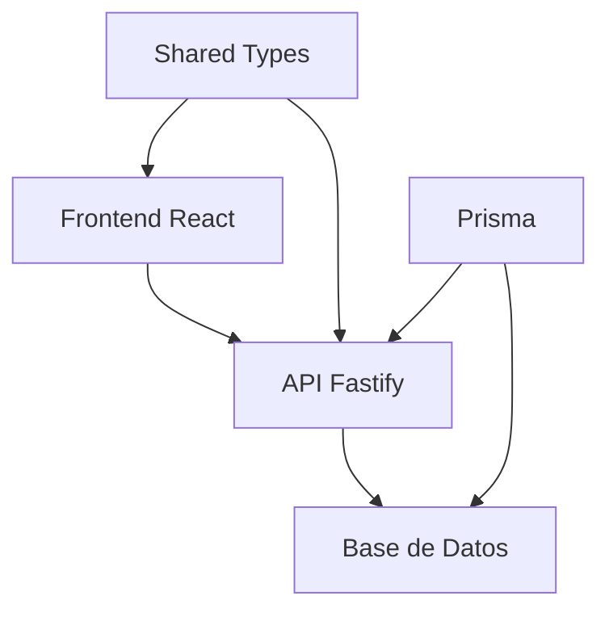

# 🏗️ Estructura del Proyecto

Este documento describe la organización de archivos y carpetas del proyecto **Social Network App**.

## 📁 Vista General

```
social-network-app/
├── 📁 backend/              # API con Fastify + TypeScript
├── 📁 frontend/             # Aplicación React + TypeScript
├── 📁 shared/               # Tipos y utilidades compartidas
├── 📁 docs/                 # Documentación del proyecto
├── 📁 .husky/               # Git hooks (Husky)
├── 📄 package.json          # Configuración del monorepo
└── 📄 README.md             # Documentación principal
```

## 🎯 Arquitectura de Monorepo

El proyecto utiliza **npm workspaces** para gestionar múltiples paquetes:

```json
{
  "workspaces": [
    "frontend",
    "backend", 
    "shared"
  ]
}
```

### Ventajas del Monorepo

- ✅ **Código compartido**: Tipos y utilidades centralizadas
- ✅ **Desarrollo sincronizado**: Cambios coordinados entre frontend/backend
- ✅ **Dependencias unificadas**: Gestión centralizada de paquetes
- ✅ **Scripts coordinados**: Comandos que afectan a todo el proyecto

## 🔙 Backend (`/backend/`)

```
backend/
├── 📁 src/
│   ├── 📁 modules/         # Módulos DDD
│   │   ├── 📁 auth/       # Módulo de autenticación
│   │   │   ├── 📁 domain/         # Entidades y lógica de dominio
│   │   │   ├── 📁 application/    # Casos de uso (LoginUseCase, etc.)
│   │   │   ├── 📁 infrastructure/ # Controllers, DTOs, Repositories
│   │   │   └── 📄 index.ts        # Exportaciones públicas
│   │   ├── 📁 posts/      # Módulo de posts
│   │   │   ├── 📁 domain/         # Post entity, value objects
│   │   │   ├── 📁 application/    # CreatePost, GetFeed, DeletePost
│   │   │   ├── 📁 infrastructure/ # PostController, PrismaPostRepository
│   │   │   └── 📄 ARCHITECTURE.md # Documentación del módulo
│   │   └── 📁 users/      # Módulo de usuarios
│   │       ├── 📁 domain/
│   │       ├── 📁 application/
│   │       └── 📁 infrastructure/
│   ├── 📁 middleware/      # Middleware (auth, role)
│   │   ├── 📄 auth.middleware.ts
│   │   └── 📄 role.middleware.ts
│   ├── 📁 config/          # Configuración (env, etc.)
│   │   └── 📄 env.ts
│   ├── 📁 lib/             # Librerías (prisma, cloudinary)
│   │   ├── 📄 prisma.ts
│   │   └── 📄 cloudinary.ts
│   ├── 📁 schemas/         # Schemas de validación TypeBox
│   │   ├── 📄 user.schemas.ts
│   │   └── 📄 post.schemas.ts
│   ├── 📁 plugins/         # Plugins Fastify
│   │   └── 📄 swagger.ts
│   ├── 📁 enums/           # Enumeraciones
│   │   └── 📄 role.enum.ts
│   ├── 📁 generated/       # Código generado (Prisma)
│   │   └── 📁 prisma/
│   ├── 📄 server.ts        # Configuración del servidor Fastify
│   └── 📄 index.ts         # Punto de entrada
├── 📁 prisma/
│   ├── 📄 schema.prisma    # Esquema de base de datos
│   └── 📁 migrations/      # Migraciones de base de datos
├── 📁 tests/              # Tests de integración
│   ├── 📄 setup.ts
│   └── 📁 integration/
│       ├── 📄 auth.routes.test.ts
│       └── 📄 posts.routes.test.ts
├── 📄 package.json         # Dependencias del backend
├── 📄 tsconfig.json        # Configuración TypeScript
├── 📄 vitest.config.ts     # Configuración de tests
└── 📄 .env                 # Variables de entorno
```

### Tecnologías Backend

- **Fastify**: Framework web rápido y eficiente
- **Arquitectura DDD**: Domain-Driven Design con capas separadas
- **Prisma**: ORM para gestión de base de datos (PostgreSQL)
- **TypeScript**: Tipado estático
- **JWT + Google OAuth**: Autenticación con tokens y login social
- **bcrypt**: Hashing de contraseñas
- **Cloudinary**: Upload y almacenamiento de imágenes
- **Swagger**: Documentación automática de API
- **Vitest**: Framework de testing

## 🎨 Frontend (`/frontend/`)

```
frontend/
├── 📁 src/
│   ├── 📁 components/       # Componentes React
│   │   ├── 📁 ui/           # Componentes UI reutilizables
│   │   └── 📁 social/       # Componentes específicos de red social
│   ├── 📁 hooks/            # Custom hooks de React
│   ├── 📁 pages/            # Componentes de página/vista
│   ├── 📁 services/         # Servicios API y comunicación
│   ├── 📁 styles/           # Estilos, temas y utilidades CSS
│   ├── 📁 theme/            # Sistema de temas (Material-UI)
│   ├── 📁 types/            # Tipos específicos del frontend
│   ├── 📁 utils/            # Utilidades del frontend
│   ├── 📄 App.tsx           # Componente principal de la app
│   └── 📄 main.tsx          # Punto de entrada de React
├── 📁 public/               # Archivos públicos estáticos
├── 📄 index.html            # Plantilla HTML principal
├── 📄 package.json          # Dependencias del frontend
├── 📄 tsconfig.json         # Configuración TypeScript
└── 📄 vite.config.ts        # Configuración de Vite
```

### Tecnologías Frontend

- **React 18**: Biblioteca de UI con hooks
- **TypeScript**: Tipado estático
- **Vite**: Build tool y dev server ultra rápido
- **Material-UI v6**: Sistema de componentes UI moderno
- **React Router**: Navegación SPA con protección de rutas
- **Axios**: Cliente HTTP para API
- **Context API**: Manejo de estado global (Auth)
- **Custom Hooks**: Lógica reutilizable (useFeed, usePostDetail, etc.)

## 🔄 Shared (`/shared/`)

```
shared/
├── 📁 src/
│   ├── 📁 types/            # Tipos compartidos
│   │   ├── 📄 index.ts      # Tipos generales
│   │   └── 📄 social.ts     # Tipos específicos de red social
│   └── 📁 utils/            # Utilidades compartidas
├── 📄 package.json          # Configuración del paquete compartido
└── 📄 tsconfig.json         # Configuración TypeScript
```

### Propósito del Shared

- **Tipos compartidos**: Interfaces y tipos usados en frontend y backend (User, Post, etc.)
- **API Types**: Tipos de request/response de la API
- **Auth Types**: Tipos de autenticación (LoginRequest, RegisterRequest, etc.)
- **Social Types**: Tipos de posts, likes, follows, etc.
- **Enums**: Valores enumerados compartidos (actualmente en cada workspace)
- **Utilidades**: Funciones auxiliares reutilizables

## 📚 Docs (`/docs/`)

```
docs/
├── 📁 setup/               # Guías de instalación y configuración
├── 📁 architecture/        # Documentación de arquitectura
├── 📁 development/         # Guías de desarrollo
├── 📁 api/                 # Documentación de API
├── 📁 frontend/            # Documentación del frontend
├── 📁 deployment/          # Guías de despliegue
├── 📁 monitoring/          # Documentación de monitoreo
└── 📄 README.md            # Índice de documentación
```

## 🔧 Archivos de Configuración

### Raíz del Proyecto

- **`package.json`**: Configuración del monorepo y scripts
- **`.gitignore`**: Archivos ignorados por Git
- **`README.md`**: Documentación principal del proyecto

### Git Hooks (`.husky/`)

- **`pre-commit`**: Ejecuta lint-staged antes de commits
- **`pre-push`**: Ejecuta tests antes de push
- **`commit-msg`**: Valida formato de mensajes de commit

### VS Code (`.vscode/`)

- **`settings.json`**: Configuración del editor
- **`extensions.json`**: Extensiones recomendadas
- **`launch.json`**: Configuración de debugging

## 🔄 Flujo de Datos


```mermaid
graph TB
    A[Frontend React] --> B[API Fastify]
    B --> C[Base de Datos]
    D[Shared Types] --> A
    D --> B
    E[Prisma] --> B
    E --> C
```

### Comunicación Entre Módulos

1. **Frontend → Backend**: Peticiones HTTP via Axios
2. **Backend → Database**: Queries via Prisma ORM
3. **Shared → Frontend/Backend**: Import de tipos y utilidades
4. **Prisma → Backend**: Generación automática de tipos y cliente

## 📦 Gestión de Dependencias

### Dependencias Compartidas

Las dependencias comunes se instalan en la raíz:
- **Herramientas de desarrollo**: ESLint, Prettier, TypeScript
- **Git hooks**: Husky, lint-staged
- **Scripts de coordinación**: concurrently

### Dependencias Específicas

Cada workspace maneja sus propias dependencias:
- **Backend**: Fastify, Prisma, JWT (@fastify/jwt), bcrypt, Cloudinary, TypeBox, Swagger
- **Frontend**: React, Material-UI, Vite, React Router, Axios
- **Shared**: Mínimas, solo utilidades específicas

## 🎯 Convenciones de Nomenclatura

### Archivos y Carpetas

- **PascalCase**: Componentes React (`UserProfile.tsx`)
- **camelCase**: Funciones y variables (`getUserData`)
- **kebab-case**: URLs y rutas (`/user-profile`)
- **UPPER_CASE**: Constantes y variables de entorno (`API_URL`)

### Estructura de Imports

```typescript
// 1. Librerías externas
import React from 'react'
import { FastifyRequest } from 'fastify'

// 2. Tipos compartidos
import { User, Post } from 'social-network-app-shared'

// 3. Imports internos (relativos)
import { Button } from '../ui/Button'
import { userService } from './userService'
```

## 🚀 Escalabilidad

### Preparado para Crecer

- **Microservicios**: Backend modular permite separación futura
- **Componentes**: Sistema de UI escalable y reutilizable
- **Tipos compartidos**: Sincronización automática entre módulos
- **Testing**: Estructura preparada para tests unitarios e integración

---

**Próximo paso**: Revisa los [Scripts Disponibles](./scripts.md) para comandos de desarrollo.
